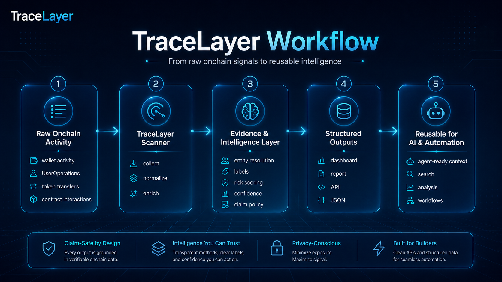
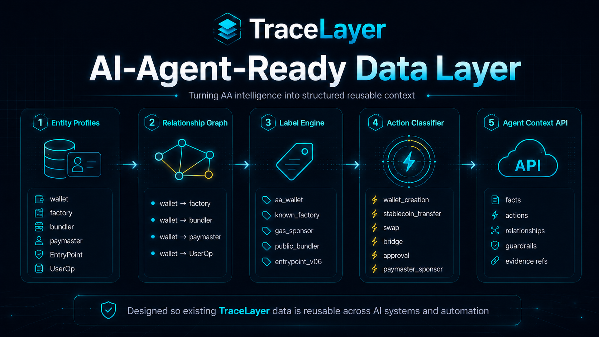
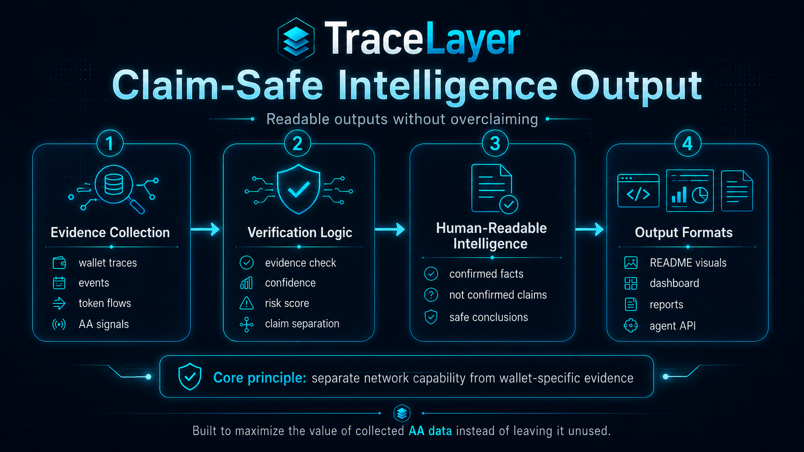

# TraceLayer

****TraceLayer** makes complex onchain activity easier to understand by turning raw wallet, contract, and asset data into structured, claim-safe intelligence.

TraceLayer converts raw onchain activity into structured, reusable, evidence-backed intelligence for dashboards, reports, developer tools, automation workflows, and AI systems.

<p align="center">
  
</p>

## What is TraceLayer?

TraceLayer is built to make complex onchain activity easier to understand.

It focuses on:

* Account Abstraction wallet intelligence
* UserOperation evidence
* Factory, bundler, paymaster, and EntryPoint context
* Token, asset, and native token movement interpretation
* Entity profiles and relationship graphs
* Claim-safe reporting
* AI-agent-ready context design

TraceLayer is not only a dashboard or PDF report generator. It is designed as a reusable intelligence layer that can serve humans, developer tools, automation workflows, and AI systems.

## Why TraceLayer Exists

Raw Account Abstraction data is difficult to interpret.

Wallet activity, UserOperations, paymasters, bundlers, factories, EntryPoint interactions, asset movement, native token usage, and application-specific signals are often fragmented across explorers, logs, indexers, and protocol-specific sources.

This makes it easy for dashboards, reports, or AI systems to overclaim unsupported activity.

TraceLayer solves this by separating:

* confirmed facts
* not-confirmed claims
* evidence references
* relationship context
* environment-level capabilities
* wallet-specific behavior
* claim-safe guardrails

## Core Principle

TraceLayer follows an evidence-first rule:

```txt
Environment capability is not wallet-specific evidence.
```

Examples:

```txt
Native token usage does not fully explain the execution path.

Application support for a feature does not prove a wallet used that feature.

An asset transfer does not prove payment intent or application intent.

Agent-ready context does not prove autonomous wallet control.

Wallet-specific claims require TraceLayer evidence references.
```

## TraceLayer Workflow

TraceLayer turns raw onchain signals into reusable intelligence:

```txt
Raw Onchain Activity
        ↓
TraceLayer Scanner
        ↓
Evidence & Intelligence Layer
        ↓
Structured Outputs
        ↓
Reusable Context for AI & Automation
```

The same collected data can be reused across:

* dashboards
* PDF reports
* REST APIs
* agent-ready context
* automation workflows
* developer tools

## AI-Agent-Ready Data Layer

TraceLayer already collects rich Account Abstraction data, including wallet activity, UserOperations, factory evidence, bundler context, paymaster context, EntryPoint interactions, actions, relationships, guardrails, and evidence references.

If this data is only used for dashboards or PDF reports, much of its value remains underused.

TraceLayer is designed to turn existing onchain intelligence into structured, reusable, AI-readable context.

<p align="center">
  
</p>

## Current Capabilities

TraceLayer currently supports:

* Account Abstraction wallet context
* Entity profiles
* Relationship graph
* Human-readable actions
* Label and action classification
* Evidence references
* Confidence and claim policy
* Claim-safe guardrails
* Environment context separation
* Agent-ready context structure

## Claim-Safe Output

TraceLayer is designed to produce readable intelligence without overclaiming.

<p align="center">
  
</p>

TraceLayer separates:

```txt
CONFIRMED
Evidence exists and can be referenced.

NOT_CONFIRMED
Evidence is insufficient. This does not prove the activity never happened.

BLOCKED_UNTIL_EVIDENCE_EXISTS
The system should not allow this claim until supporting evidence exists.
```

Examples of blocked claims without evidence:

* payment attribution
* application intent
* sponsored execution
* paymaster usage
* bundler usage
* bridge usage
* swap usage
* protocol-specific app usage
* automated workflow control

## Documentation

* [Problem](docs/01-PROBLEM.md)
* [Why Existing Solutions Fail](docs/02-WHY-EXISTING-SOLUTIONS-FAIL.md)
* [Solution](docs/03-SOLUTION.md)
* [Architecture](docs/04-ARCHITECTURE.md)
* [Agent-Ready Context](docs/05-AGENT-READY-CONTEXT.md)
* [Claim Safety](docs/06-CLAIM-SAFETY.md)
* [Proofs](docs/07-PROOFS.md)
* [Roadmap](docs/08-ROADMAP.md)

## Roadmap

TraceLayer is being developed in stages:

```txt
1. Foundation
   Build the core scanner, evidence engine, and report system.

2. Intelligence Layer
   Improve entity profiles, relationships, labels, confidence, and claim policy.

3. Context Layer
   Expand reusable context outputs, evidence references, adapters, and developer experience.

4. Scale & Adoption
   Improve performance, add more data depth, and grow ecosystem usage.
```

## Product Direction

TraceLayer turns raw Account Abstraction activity, asset movement, native token usage, and application-specific interactions into AI-readable, claim-safe intelligence context.

The goal is simple:

```txt
One data layer.
Many reusable outputs.
No unsupported claims.
```

## Status

> Status: Active development / private beta preparation.

TraceLayer is currently focused on Account Abstraction intelligence, evidence-backed reporting, claim-safe outputs, and AI-agent-readable context.
